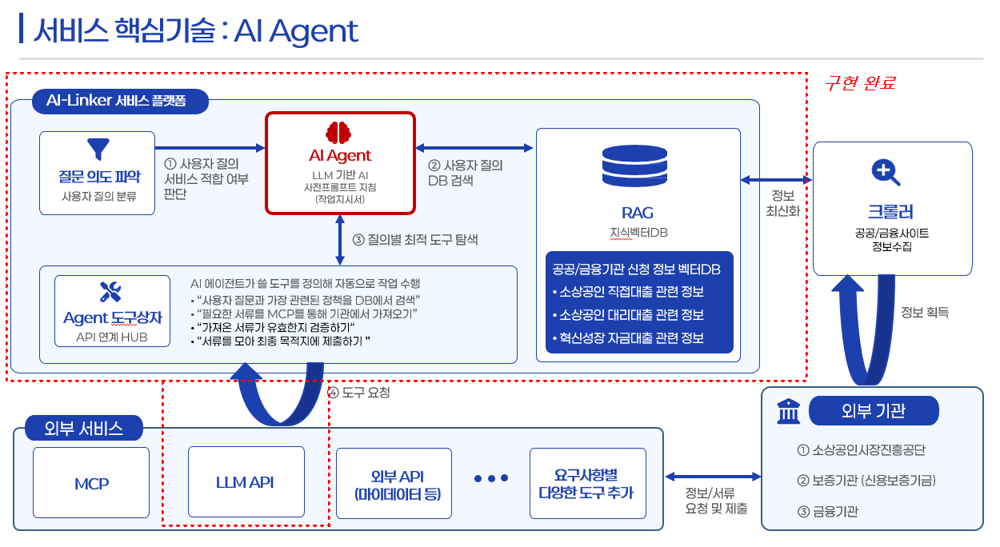
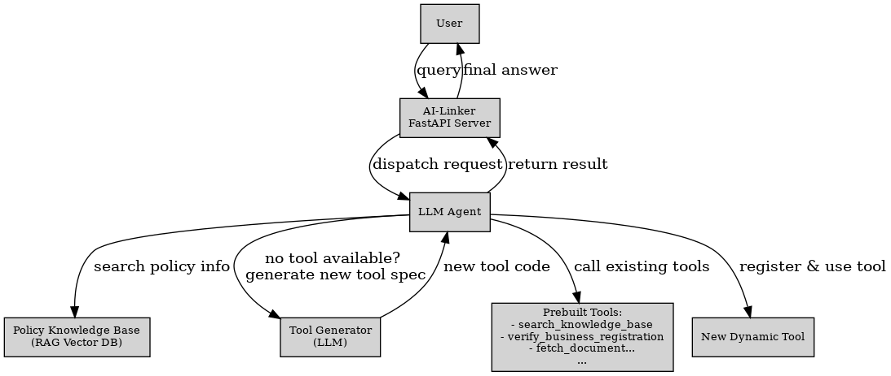

# AI-Linker 서비스

**AI-Linker 서비스**는 대규모 언어 모델(LLM)을 활용하여 **정책서비스 신청 업무를 자동화**하는 AI 에이전트 서비스입니다. 사용자는 이 서비스를 통해 정책서비스 신청과 관련된 질의응답 및 서류 제출 과정을 간편하게 처리할 수 있습니다. 본 서비스는 간단한 MVP 서비스로, 엔드포인트는 FastAPI로 구축되었으며, 간략하게 아래 **3개의 주요 REST API**를 제공합니다. 각 엔드포인트는 에이전트와 상호작용하거나 에이전트의 내부 정보를 조회하는 기능을 수행합니다.

## 서비스 흐름 및 아키텍처

AI-Linker는 **정책서비스 신청 및 관리 절차 전체를 AI 에이전트를 통해 자동화**하는 것을 목표로 합니다. 서비스의 흐름은 다음과 같이 구성됩니다:

1. **사용자 질의** : 사용자가 서버를 통해 정책서비스 신청 관련 질문을 전달합니다.  
2. **에이전트 실행** : LLM 기반 에이전트가 질의를 해석하고, SOP(표준 운영 절차)에 따라 적절한 작업을 수행합니다.  
3. **정책 데이터 검색** : 필요 시 정책 벡터 DB(RAG)를 조회하여 최신 정책 정보를 확보합니다.  
4. **도구 활용 및 생성** : 기존 내장 도구(예: 정책 조회, 사업자 등록 확인, 서류 발급 등)를 호출하거나, 도구가 없을 경우 자체적으로 새로운 도구 코드를 생성하여 등록 후 실행합니다.  
5. **신청 프로세스 자동화** : 서류 수집, 신청서 작성, 제출까지 일련의 과정을 자동화합니다.  
6. **결과 반환** : 최종 결과(예: 신청 성공 여부, 필요한 후속 조치 등)를 사용자에게 반환합니다.  

아래 그림은 AI-Linker의 서비스 아키텍처 및 흐름을 시각적으로 보여줍니다:




우리가 제작한 MVP 서비스에서는 '소상공인진흥공단' 의 '소상공인 지원상품' 들을  AI-Linker 를 통해 자동화하는 서비스를 제작하였습니다.


## 주요 API 엔드포인트

### 1. `/run-agent` (POST)

`/run-agent` 엔드포인트는 **AI 에이전트를 실행**하여 사용자의 요청을 처리하는 핵심 API입니다.  
- 질문 해석 및 의도 파악  
- SOP 기반 실행  
- 정보 자동 수집  
- 동적 도구 활용 및 생성  
- 응답 생성  

#### 요청 예시
```bash
curl -X POST "http://<server-address>/run-agent" \
     -H "Content-Type: application/json, API_KEY: APP_API_KEY" \
     -d '{
           "user_id": "example-user-123",
           "query": "현재 내 업체가 신청 가능한 지원금은 무엇인가?"
         }'
```

#### 응답 예시
```json
{
  "status": "success",
  "final_result": {
    "status": "success",
    "message": "소상공인 자금 지원 신청이 성공적으로 완료되었습니다. 신청 ID는 APP_5733입니다. 신청 진행 과정은 소진공의 안내에 따라 추후 확인하실 수 있습니다."
  },
  "execution_log": [
    "[Alarm]## AI Agent Process Start (Query: '스타트업 창업 자금 지원받고 싶어.') ##",
    "   [Gatekeeper] 사용자 질문의 의도를 분류합니다...",
    ". [STEP] Agent Step 1",
    ". [STEP] Agent Step 2",
    ...
    "   [Thought] 모든 작업이 완료되었다고 판단했습니다.",
    "   [Final Answer] 소상공인 자금 지원 신청이 성공적으로 완료되었습니다. 신청 ID는 APP_5733입니다. 신청 진행 과정은 소진공의 안내에 따라 추후 확인하실 수 있습니다."
  ]
}
```

---

### 2. `/rag-content` (GET)

`/rag-content` 엔드포인트는 현재 AI 에이전트가 보유하고 있는 **정책 정보 벡터 DB(RAG)** 내용을 조회하는 기능을 제공합니다.

#### 응답 예시
```json
[
     {
       "rag_documents": {
         "SBC_LOAN": "소상공인 정책자금 직접대출은 소상공인의 자금 조달을 돕습니다. 필수 서류는 사업자등록증명원, 국세납세증명서입니다.",
         "YOUTH_ACCOUNT": "청년도약계좌는 청년의 자산 형성을 지원하는 정책형 금융상품입니다. 가입을 위해 소득확인증명서가 필요합니다."
       }
     }
]
```

---

### 3. `/users` (GET)

`/users` 엔드포인트는 **현재 AI-Linker 에이전트 서비스를 이용 중인 사용자들의 목록 및 관련 정보를 조회**하는 API입니다. 개인정보 보호를 위해 별도의 DB에 관리되며, 최소한의 식별자만 반환합니다.

#### 응답 예시
```json
[
     {
       "user_ids": [
         "user_kim",
         "user_lee"
       ]
     }
]
```

---

## 요약

AI-Linker FastAPI 서비스는 `/run-agent`, `/rag-content`, `/users` 세 가지 엔드포인트 api를 중심으로 사용자 질의 처리, 에이전트 지식베이스 확인, 그리고 사용자 정보 확인 기능을 제공합니다.  
서비스 흐름은 **LLM 에이전트가 정책 DB와 도구들을 활용해 질의를 처리하고 필요한 경우 새로운 도구까지 생성**하는 구조로, 정책서비스 신청 프로세스를 자동화합니다.
